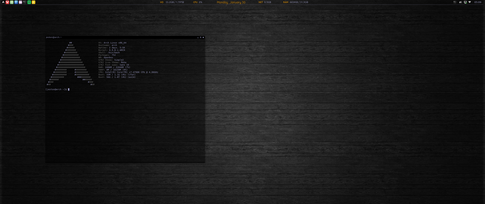

#### My Arch Desktop

#### Arch install guide

This is the best guide I have found to help me through the install process. I dont follow it word for word, but the most important thing to me is getting the bootloader set up correctly which I follow exactly. Ive archived it here `/install_guide` in case the link ever dies. My disk setup is everything on the root partition with a swapfile.

http://gloriouseggroll.tv/arch-linux-efi-install-guide/

#### My Setup
* **Window Manager**: Openbox
* **Launcher**: Lxpanel
* **Taskbar/System Tray**: Tint2
* **GTK Theme**: Simple2 `/configs/Simple2`
* **Icon Theme**: Moka
* **Terminal**: Lxterminal with Alsi
* **Compositor**: Compton
* **File Manager**: Thunar
* **Browser**: Chromium
* **Editor**: Atom
